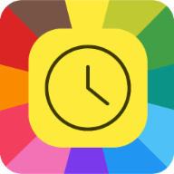

# FollowApp MyTime

```
Boost productivity with MyTime - part of the FollowApps suite
```



Welcome to `FollowApp MyTime`, your personal time management assistant. Our app is designed to help you understand how you spend your time, empowering you to make the most of every moment.

- Understand Your Time: `MyTime` measures the time you spend on each task, providing valuable insights into your daily and weekly activities. Whether you’re working, studying, exercising, or just relaxing, `MyTime` keeps track of it all.

- Manage Your Time: Understanding how you spend your time is the first step towards effective time management. `MyTime` helps you make informed decisions about how to allocate your time, helping you focus on what truly matters.

- Improve Your Time: With the information generated by `MyTime`, you can identify areas for improvement and make necessary adjustments. Are you spending too much time on less important tasks? MyTime will let you know!

Join us on this journey towards better time management. Download `MyTime` today and start making every second count!

---

### Notes

- This app is currently in production. You can install it on your Android device using this [link](https://play.google.com/store/apps/details?id=com.followapp.mytime).
- Your feedback is greatly appreciated! Please fill out this [form](https://forms.gle/mjtrWYTF1QK9YW5m6) or contact me directly at [email](mailto:aghmin@gmail.com).
